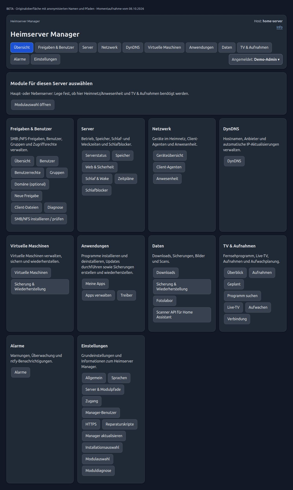

# Heimserver Manager · Home Server Manager

**Webbasierte Heimserver-Verwaltung für Debian: Anwendungen, Backups, Dateifreigaben, KVM und energiesparender Serverbetrieb.**

**BETA:** Entwicklungsstand zur Erprobung. Funktionen können Fehler enthalten oder sich ändern. Vor Installation und Updates Daten sichern. Debian 13 ist die primäre Zielplattform; Mint 22.x und der Windows-Client sind zusätzlich experimentell.

[English](docs/en/README.md) · [ZIP & DEB herunterladen](https://github.com/WillibaldSoft/heimserver-manager/releases) · [Installation](docs/RELEASE_INSTALLATION.txt) · [Funktionsübersicht](docs/Heimserver_Manager_Funktionsuebersicht.txt) · [Fragen & Fehler melden](https://github.com/WillibaldSoft/heimserver-manager/issues)

**English summary:** A self-hosted home server dashboard for Debian Linux and homelabs. Manage applications, backups and recovery, Samba/SMB and NFS shares, users, KVM/libvirt virtual machines, DynDNS, and Wake-on-LAN with presence-based sleep control. German and English web interface.

## Einblicke in die Oberfläche

[Screenshot-Galerie: sieben wichtige Bereiche](docs/SCREENSHOTS.md)

Übersicht anzeigen (anonymisiert)

## Für wen ist der Manager gedacht?

Für einen Linux-Heimserver oder ein Homelab, dessen Dienste, Speicher und Sicherungen über eine gemeinsame Weboberfläche bedient werden sollen. Die Oberfläche ist für Desktop und Smartphone ausgelegt. Der Manager ergänzt das vorhandene Linux-System; die nutzbaren Funktionen hängen von installierten Diensten, Hardware und Einrichtung ab.

## Funktionen

| Bereich | Möglichkeiten |
| --- | --- |
| Apps & Updates | Anwendungen installieren und verwalten; APT-Pakete, Docker und anwendungsspezifische Updateprüfungen. Integrationen unter anderem für Nextcloud, Immich, Jellyfin, Plex, Pi-hole, Open WebUI und Ollama. |
| Backup & Wiederherstellung | Server- und Anwendungssicherungen, tägliche inkrementelle Sicherungskette, externe Gesamtsicherung und Client-Backup. Umfang und Rücksicherung hängen vom gewählten Profil ab. |
| Freigaben & Benutzer | Samba/SMB und NFS, lokale Benutzer und Gruppen, Zugriffsrechte, getrennte Linux-/SMB-Passwörter und administratorgeschützte sudo-Zuordnung. |
| Virtuelle Maschinen | KVM/libvirt: VMs anlegen und importieren, starten/stoppen, sichern und wiederherstellen; Backup-Download und Upload. |
| Schlaf & Wake | Zeitpläne, Anwesenheit, Client-Schlafblocker, Wake-on-LAN und optionale Power-/Recovery-API. |
| Netzwerk & HTTPS | Heimnetzübersicht, DynDNS, Ziele und Dienste, Weiterleitungen/Reverse Proxy sowie Zertifikatsstatus. |
| Speicher & Alarme | Mountpunkte, Festplattenstatus, SMART-Prüfungen und Benachrichtigungen über ntfy. |
| Medien & Daten | TVheadend mit EPG und Aufnahmen, Fotolabor, Downloads/Uploads und Scanner-API für Home Assistant. |
| Client-Agenten | Linux-DEB und experimentelle Windows-EXE: Serverbedarf melden, Server wecken, persönliche Profile und Sicherungsfunktionen. Funktionsumfang unterscheidet sich je Plattform. |

[Alle Funktionen und Grenzen](docs/Heimserver_Manager_Funktionsuebersicht.txt) · [Versionshistorie](docs/Heimserver_Manager_Versionsaenderungen.txt)

## Download und Einstieg

1. Unter **[Releases](https://github.com/WillibaldSoft/heimserver-manager/releases)** die gewünschte Beta-Version öffnen und **Assets** aufklappen.
2. Für die Erstinstallation das passende **Debian_Komplett.zip** oder **Mint_Komplett.zip** herunterladen. Es enthält DEB, `install_deb.sh`, Installationshinweise, Lizenzen und Dokumentation.
3. Installationshinweise lesen, vorhandene Daten sichern und den Installer auf dem Zielrechner ausführen. Zusätzliche Anwendungen nach Bedarf im Manager installieren.
4. Eine bestehende Paketinstallation lässt sich mit der passenden **DEB** über **Einstellungen → Manager aktualisieren** aktualisieren. Manuelle Quellinstallationen benötigen eine geplante Migration.

**„Code → Download ZIP“ enthält den Quellcode. Die Installationspakete liegen unter Releases.** Prüfsummen stehen bei den Downloads und im Komplettpaket bereit.

| Plattform | Stand |
| --- | --- |
| Debian 13 | Primäre Plattform, Beta |
| Linux Mint 22.x | Separates experimentelles Paket; keine Produktivfreigabe |
| Linux-/Windows-Client | Getrennte Client-Pakete; Windows experimentell |

## Dokumentation und Mithilfe

- [Dokumentationsübersicht](docs/DOCUMENTATION.md) und [englische Dokumentation](docs/en/README.md)
- [Plattformgrenzen](docs/PLATTFORMEN.md) und [Release-Erstellung](docs/GITHUB_RELEASE.md)
- [Issues](https://github.com/WillibaldSoft/heimserver-manager/issues) für Fehler, Fragen und Funktionswünsche. Bitte Version, Betriebssystem und nachvollziehbare Schritte angeben; Passwörter, Tokens, private Domains und persönliche Daten aus Protokollen entfernen.
- Verbesserungen am Code oder an Übersetzungen sind über Pull Requests willkommen. Ein Stern hilft, das Projekt wiederzufinden.

## Technik und Lizenz

Python-/Flask-Weboberfläche mit Linux-Systemdiensten. Dienst: `server-manager.service`; Programm: `/opt/server-manager`; Konfiguration: `/etc/server-manager`; Laufzeitdaten: `/var/lib/server-manager`. Release-Bau: `python3 tools/build_release.py`; Versionsquelle: `version.py`.

Copyright (C) 2026 Andreas Willibald. Eigene Projektbestandteile: **GPL-3.0-or-later**. [Lizenztext](LICENSE) · [Lizenzhinweise](LICENSE_NOTICE.md) · [Drittanbieter](THIRD_PARTY_NOTICES.md)
