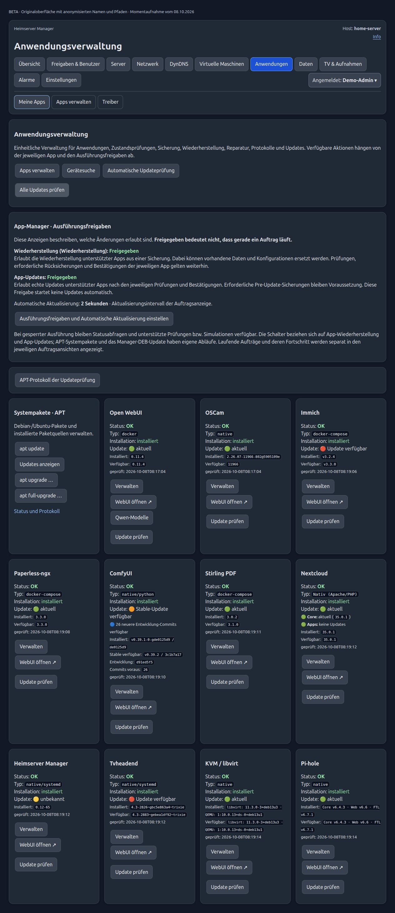
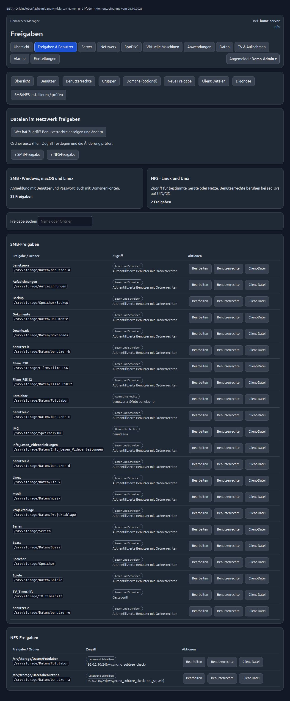
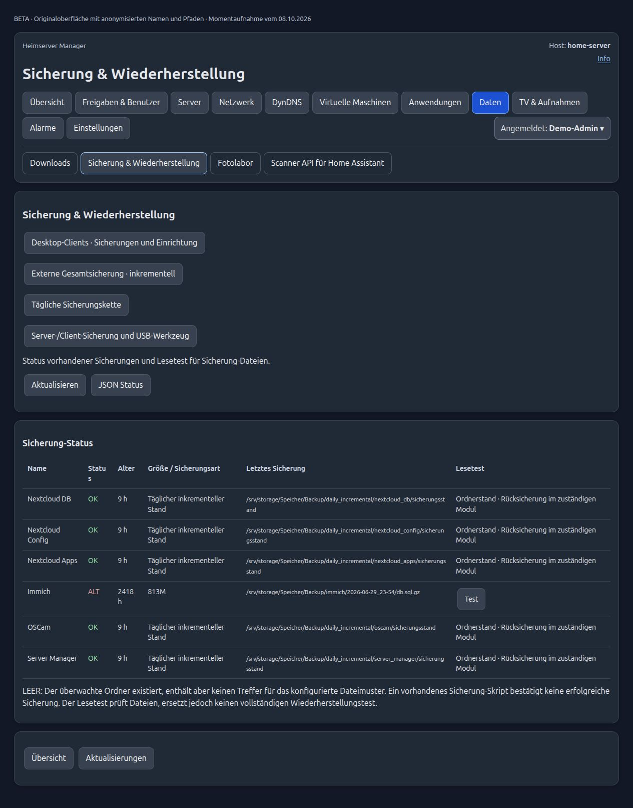
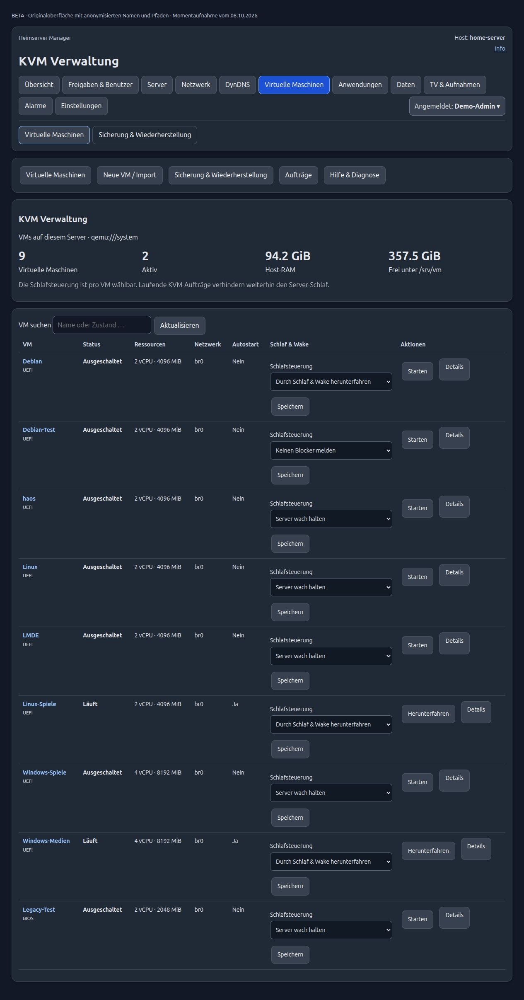
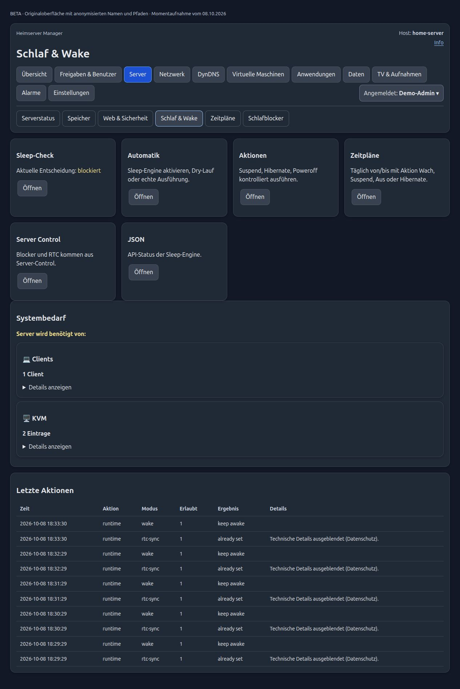
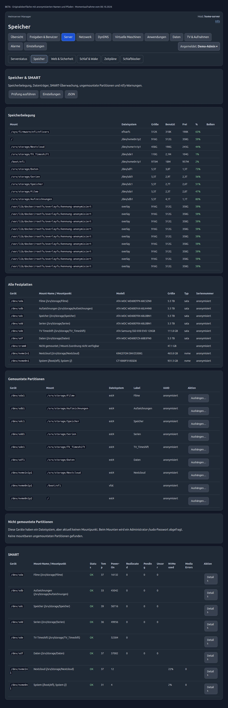

# Screenshots · Home Server Manager

Beta 0.12-65 · captured October 8, 2026. Browser screenshots of static copies of the actual German interface. Personal, host and VM names, paths, IP addresses, UUIDs and serial numbers have been anonymized; personal log details have been hidden. No AI-generated interfaces. Status and available features are snapshots and depend on the installation.

[German captions](../SCREENSHOTS.md) · [Project overview](README.md)

## Dashboard

## Applications and updates

## SMB and NFS shares

## Backup and recovery

## Virtual machines

## Sleep & Wake

## Storage and SMART

